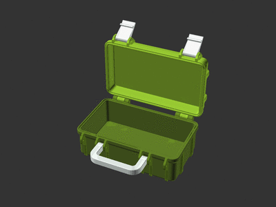
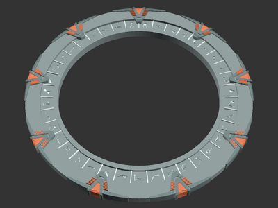

# My OpenSCAD models for 3D printing

[![bulbasaur0 on Printables][printables-profile-badge]][printables-profile]

A monorepository for my [OpenSCAD][openscad] models and remixes. Print-ready
models are also [published on Printables][printables-profile].

## Setup

Models in this repository depend on various
[third-party libraries][openscad-libraries], which are provided as
[git submodules][git-submodules] using
[smkent/openscad-libraries][smkent-openscad-libraries].

After cloning this repository, install all third-party libraries by running in
the repository directory:

```console
git submodule update --init --recursive
```

## Rendering models via CLI

Each model has preconfigured renders to be created via the
[OpenSCAD CLI][openscad-cli] using [SCons][scons].
Model STL files published to Printables are rendered this way.

SCons is a Python package and can be installed using `pip`:

```console
pip install --user scons
```

To build the configured model renders for a particular model, change to the
desired model directory and run:

```console
scons -u
```

Rendered models will be placed in a `build` subdirectory within the model
directory.

## Model samples

Click an image to view the corresponding model, or browse subdirectories for all
models.

[](rugged-box/)
[](modular-hose/)
[](gridfinity-bins-material-swatches/)
[](bosch-custom-case/bit-clips/)
[](stargate/)
[](bathtub-drain-hair-catcher/)

## License

### Models

Each model in this repository is licensed individually, especially for remixes
which must maintain compatible licensing with their original model(s).

See `README.md` and/or any `LICENSE` files within a model's subdirectory for
that model's license.

### Third party libraries

Third party libraries have their own licenses.

### Monorepository

All remaining contents of this repository (i.e. not models or third party
libraries) are licensed under [Creative Commons (4.0 International License)
Attribution][license-cc-by-4.0].


[git-submodules]: https://git-scm.com/book/en/v2/Git-Tools-Submodules
[license-cc-by-4.0]: http://creativecommons.org/licenses/by/4.0/
[openscad-cli]: https://en.wikibooks.org/wiki/OpenSCAD_User_Manual/Using_OpenSCAD_in_a_command_line_environment
[openscad-libraries]: https://en.wikibooks.org/wiki/OpenSCAD_User_Manual/Libraries
[openscad]: https://openscad.org
[printables-profile-badge]: /_static/printables-profile-badge.svg
[printables-profile]: https://www.printables.com/@bulbasaur0/models
[scons]: https://scons.org/
[smkent-openscad-libraries]: https://github.com/smkent/openscad-libraries
