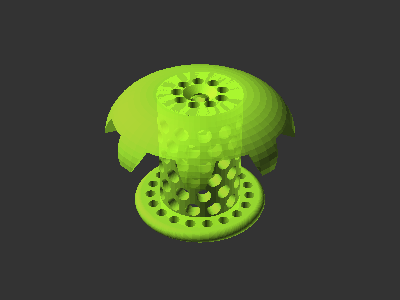

# Bathtub Drain Hair Catcher

[![CC-BY-SA-4.0 license][license-badge]][license]

Bathtub drain hair catcher

# Description

While hiring a plumber to clear my hair-clogged bathtub drain, I learned about
drain hair catchers that can prevent hair clogs from forming in the first place.
Instead of buying one, I created my own!

From similar retail drain hair catchers, it seems bathtub drains in the US are
generally all the same size. The model is configurable if your drain happens to
be a different size.

A handful of shape variations are available to select between the pictured
curved top shape and an easier print.

## Printing

The curved ("winged") top model can be printed one of two ways, both of which
require supports:

* Upside down -- add supports with your slicer. I used snug supports for the top
  curve (on the print bed) and the bottom piece which fits into the drain (at
  the top when upside down).
* Right side up -- render the model with the included "Print Supports" option in
  OpenSCAD to print with the included supports. I could not get my slicer to
  produce reliable supports in this orientation, so I added supports to the
  model itself.

A flat-top variation of is included. Select "Flat" for Top Style in OpenSCAD to
use this variant. The flat top variant should be printed upside down. If using
the default "Flat" value for "Bottom Style", add supports to the hair catcher
bottom (at the top when printing) using your slicer. Alternatively, select
"Angled" for "Bottom Style" to print the flat-top model without any supports.

## Usage

If your bathtub has an existing drain grate, remove it. Then, just pop your
printed drain hair catcher into the drain!

Every so often, simply pull the hair catcher out of the drain, remove the
collected hair off with a paper towel or so, and place the hair catcher back
into the drain.

## License

This model is licensed under [Creative Commons (4.0 International License) Attribution-ShareAlike][license].

[license]: http://creativecommons.org/licenses/by-sa/4.0/
[license-badge]: /_static/license-badge-cc-by-sa-4.0.svg
