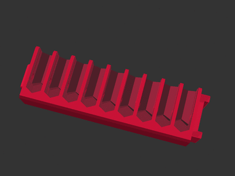

# Drill bit clips for Bosch Custom Case

[![CC-BY-SA-4.0 license][license-badge]][license]

Parametric drill/drive bit clips for Bosch Custom Cases

# Description

Put the custom into your [Bosch Custom Case][bosch-custom-case] with custom bit
clips! These cases have slots for clips of drill and drive bits, but the OEM
clips are only available with bits included. Create your own bit clips with this
model!

## Features

* Up to **9** bit slots per clip -- OEM clips only have 8 slots
* Select between slots for quick change or driver insert bits
* Optionally stack two rows of bits in one clip (up to 18 total bits)
* Optionally point bit slots downward for easier bit storage at the top of your
  case
* Optionally add a blank channel to part of a clip for tall bit pass through

## Rendering and Printing

Open `custom-case-bits-insert.scad` in OpenSCAD, and use the Customizer options
to configure your bit clip:

Bit clips print with no supports. Bit slot walls bend slightly when
inserting/removing bits, so I like printing my clips using PETG. PLA should also
work fine.

## See Also

Before making this model from scratch, I printed a couple clips using
[Benjamen Johnson's bit clip model on
Thingiverse][bosch-custom-case-system-insert-by-benjamenjohnson].
[His web site][benjamenjohnson-web-site] has more models for the Bosch Custom
Case system, and [his Thingiverse page][benjamenjohnson-thingiverse] has a
variety of useful models for various toolbox systems.

## License

This model is licensed under [Creative Commons (4.0 International License) Attribution-ShareAlike][license].

[bosch-custom-case]: https://www.boschtools.com/us/en/boschtools-ocs/custom-case-system-35868-c/
[license]: http://creativecommons.org/licenses/by-sa/4.0/
[license-badge]: /_static/license-badge-cc-by-sa-4.0.svg
[bosch-custom-case-system-insert-by-benjamenjohnson]: https://www.thingiverse.com/thing:3440818
[benjamenjohnson-web-site]: https://3dprints.electronsmith.com/?s=bosch+custom+case
[benjamenjohnson-thingiverse]: https://www.thingiverse.com/benjamenjohnson/designs
