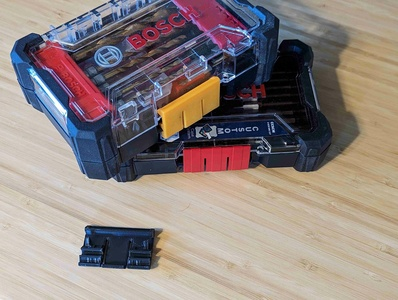
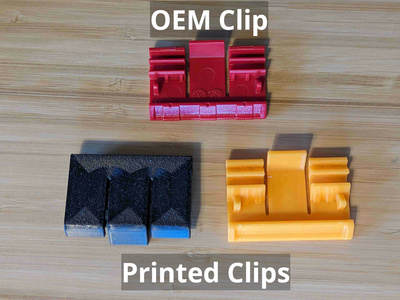
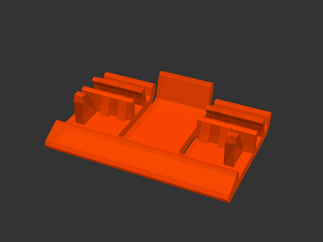

# Box latch for Bosch Custom Case / Pick and Click

[![CC-BY-SA-4.0 license][license-badge]][license]

Replacement latch for Bosch Custom Case / Pick and Click cases

# Description

This is a replacement latch for [Bosch Custom Case][bosch-custom-case] / Pick
and Click bit storage boxes.

## Printing

The latch flexes in normal use. I printed this with 3 perimeters for strength.
Latches printed with PLA seem to work, although I prefer PETG for these.

Printing with a concentric bottom fill pattern makes a nice look for this print.

## Installation

Simply snap the latch onto the box's latch clip!

## See also

I also have [parametric drill/drive bit clips](/bosch-custom-case/bit-clips)
for Bosch Custom Case / Pick and Click cases!

## License

This model is licensed under [Creative Commons (4.0 International License) Attribution-ShareAlike][license].

[bosch-custom-case]: https://www.boschtools.com/us/en/boschtools-ocs/custom-case-system-35868-c/
[license-badge]: /_static/license-badge-cc-by-sa-4.0.svg
[license]: http://creativecommons.org/licenses/by-sa/4.0/
