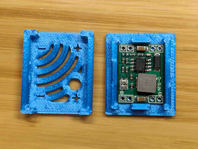
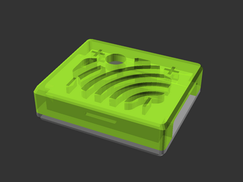

# MP1584 buck converter case

[![Available on Printables][printables-badge]][printables-model]
[![CC-BY-SA-4.0 license][license-badge]][license]

Case for an MP1584 or MP1584EN buck converter




# Description

The MP1584 is a small DC buck converter with an optional adjustment
potentiometer. This model is a case for an MP1584 buck converter, with an
optional opening to access the potentiometer while the case is assembled.

This prints with no supports and simply snap fits together.

## Customization

The [OpenSCAD][openscad] source model has a handful of customization options,
such as the board orientation (potentiometer hole top or bottom selection),
interlock visual style, and end cap hole(s) style.

## Usage within other models

The [OpenSCAD][openscad] source model can be used by itself or as a library
within another model.

To use as a library, place `mp1584-case.scad` in the same directory as the other
model. At the top of your OpenSCAD model file, add:

```openscad
use <mp1584-case.scad>;
```

Then, you can add an MP1584 case top or bottom using one of:

```openscad
mp1584_case(part="top");
mp1584_case(part="bottom");
```

## License

This model is licensed under [Creative Commons (4.0 International License) Attribution-ShareAlike][license].


[license-badge]: /_static/license-badge-cc-by-sa-4.0.svg
[license]: http://creativecommons.org/licenses/by-sa/4.0/
[openscad]: https://openscad.org
[printables-badge]: /_static/printables-badge.png
[printables-model]: https://www.printables.com/model/681024
