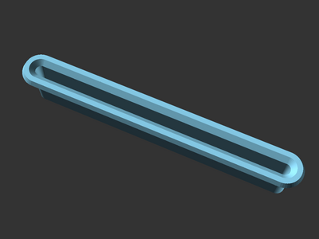
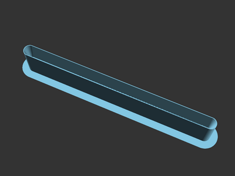
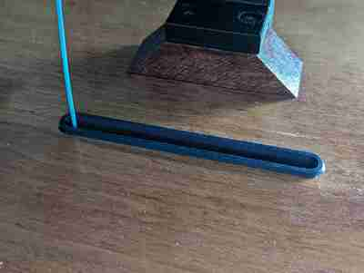
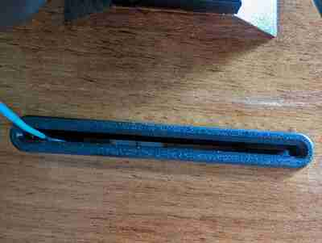

# 3D Printer Enclosure Filament Grommet

An OpenSCAD-configurable filament grommet for a 3D printer enclosure.

[This model is also available on Printables][printables].

## Description

This is an OpenSCAD-configurable grommet I designed for my 3D printer enclosure.
It has a configurable taper on the interior to reduce the enclosure opening size
with the grommet installed.

With a 1/4" straight bit on my wood router, I cut out a straight line and then
printed a grommet using this design based on the size. The grommet rests in the
cut out slot in my enclosure.

This prints upside down without support.

## License

This model is licensed under [Creative Commons (4.0 International License) Attribution-ShareAlike][license].

[printables]: https://www.printables.com/model/584616
[license]: http://creativecommons.org/licenses/by-sa/4.0/
