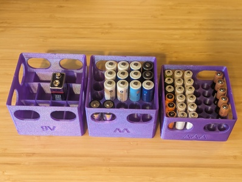
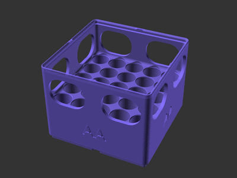

# Gridfinity Battery Bins (remix)

![This model is a work in progress][work-in-progress-badge]
[![CC-BY-SA-4.0 license][license-badge]][license]

Gridfinity battery bins

## Description

I really liked
[**xavierly**'s **Definitive Collection of Battery Holders (Gridfinity, Stackable & Labelled)**][xavierly-model-original],
but I needed bins of different heights.

This model is a parametric implementation of Gridfinity bins for AA, AAA, and 9V
batteries in [OpenSCAD][openscad] using
[**Gridfinity Rebuilt in OpenSCAD** by **kennetek**][gridfinity-rebuilt-openscad].

For more battery types, I recommend **xavierly**'s original bin models:

* [Common battery types][xavierly-model-original]
* [AGx batteries][xavierly-model-agx]
* [CRxx batteries][xavierly-model-crxx]
* [LRxx batteries][xavierly-model-lrxx]

## Setup

See [the top-level README.md](/README.md) for libraries installation.

## Differences of the remix compared to the original

This uses
[**Gridfinity Rebuilt in OpenSCAD** by **kennetek**][original-model-url]
to create Gridfinity bins for storing AA, AAA, and 9V batteries.

## Attribution and License

This model is licensed under
[Creative Commons (4.0 International License) Attribution-ShareAlike][license].

This is a remix of
[**Gridfinity Rebuilt in OpenSCAD** by **kennetek**][original-model-url], which
is licensed under the [MIT License][gridfinity-license].

[gridfinity-license]: LICENSE.gridfinity
[gridfinity-rebuilt-openscad]: https://github.com/kennetek/gridfinity-rebuilt-openscad
[license-badge]: /_static/license-badge-cc-by-sa-4.0.svg
[license]: http://creativecommons.org/licenses/by-sa/4.0/
[openscad]: https://openscad.org
[original-model-url]: https://github.com/kennetek/gridfinity-rebuilt-openscad
[work-in-progress-badge]: /_static/work-in-progress-badge.svg
[xavierly-model-agx]: https://www.printables.com/model/442231-agx-button-cell-battery-holders-gridfinity-stackab
[xavierly-model-crxx]: https://www.printables.com/model/442365-crxxxx-button-cell-battery-holders-gridfinity-stac
[xavierly-model-lrxx]: https://www.printables.com/model/442274-lrxx-button-cell-battery-holders-gridfinity-stacka
[xavierly-model-original]: https://www.printables.com/model/381400-definitive-collection-of-battery-holders-gridfinit
