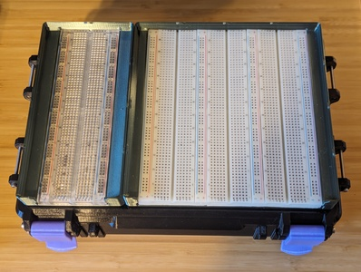
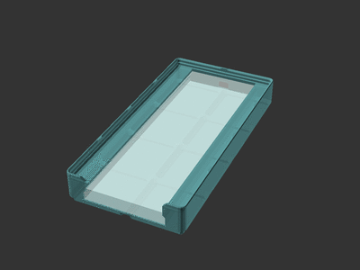

# Gridfinity Breadboard Bins

[![Available on Printables][printables-badge]][printables-model]
[![CC-BY-SA-4.0 license][license-badge]][license]

Gridfinity bins for breadboards

## Description

These are parametric Gridfinity bins for storing breadboards, created in
[OpenSCAD][openscad] using
[**Gridfinity Rebuilt in OpenSCAD** by **kennetek**][gridfinity-rebuilt-openscad].

## Setup

See [the top-level README.md](/README.md) for libraries installation.

## Configuration

The breadboard size and number of breadboards are both configurable in the
OpenSCAD source model.

In the preconfigured model renders, the 4x4 3-breadboard holder is sized to fit
3 breadboards with 4 total power rails (instead of 6).

## Differences of the remix compared to the original

This uses [my remix][rebuilt-bins-model] of
[Gridfinity Rebuilt in OpenSCAD][gridfinity-rebuilt-openscad]
to create breadboard bins.

## Attribution and License

This model is licensed under
[Creative Commons (4.0 International License) Attribution-ShareAlike][license].

This is a remix of [my remix][rebuilt-bins-model] of
[**Gridfinity Rebuilt in OpenSCAD** by **kennetek**][gridfinity-rebuilt-openscad].

[Gridfinity][gridfinity] and
[Gridfinity Rebuilt in OpenSCAD][gridfinity-rebuilt-openscad]
use the [MIT License][gridfinity-license].

[gridfinity-license]: LICENSE.gridfinity
[gridfinity-rebuilt-openscad]: https://github.com/kennetek/gridfinity-rebuilt-openscad
[gridfinity]: https://www.youtube.com/watch?v=ra_9zU-mnl8
[license-badge]: /_static/license-badge-cc-by-sa-4.0.svg
[license]: http://creativecommons.org/licenses/by-sa/4.0/
[openscad]: https://openscad.org
[printables-badge]: /_static/printables-badge.png
[printables-model]: https://www.printables.com/model/764343
[rebuilt-bins-model]: ../rebuilt-bins/
