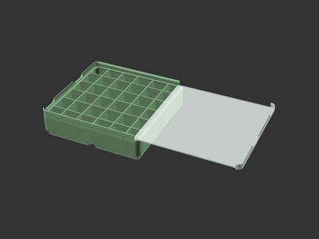

# Covered Bins (remix)

![This model is a work in progress][work-in-progress-badge]
[![CC-BY-4.0 license][license-badge]][license]

Gridfinity bins with covers

## Differences of the remix compared to the original

## Attribution and License

This is a remix of
[**Gridfinity 1 x 1 x 2 and 1 x 1 x 3 inserts with cover, divided in multiple ways** by **mhejjas**][original-model-url].

Both the original model and this remix are licensed under
[Creative Commons (4.0 International License) Attribution][license].

[original-model-url]: https://www.printables.com/model/665798-gridfinity-1-x-1-x-2-and-1-x-1-x-3-inserts-with-co
[license]: http://creativecommons.org/licenses/by/4.0/
[license-badge]: /_static/license-badge-cc-by-4.0.svg
[work-in-progress-badge]: /_static/work-in-progress-badge.svg
