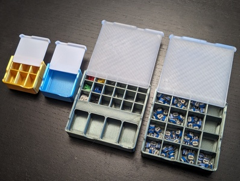

# Gridfinity Bins with Lids (parametric remix)

[![Available on Printables][printables-badge]][printables-model]
[![CC-BY-4.0 license][license-badge]][license]

Gridfinity bins with lids (covers), reimplemented as a parametric model in
[OpenSCAD][openscad]

## Description

I really like
[**mhejjas' Gridfinity 1 x 1 x 2 and 1 x 1 x 3 inserts with cover, divided in multiple ways**][original-model-url],
but I also wanted to make bins of arbitrary sizes.

This is a parametric reimplementation of the original model in OpenSCAD, using
[**Gridfinity Rebuilt in OpenSCAD** by **kennetek**][gridfinity-rebuilt-openscad]
for the core [Gridfinity][gridfinity] elements.

## Setup

See [the top-level README.md](/README.md) for libraries installation.

## Differences of the remix compared to the original

This is a reimplementation of
[**Gridfinity 1 x 1 x 2 and 1 x 1 x 3 inserts with cover, divided in multiple ways** by **mhejjas**][original-model-url]
in [OpenSCAD][openscad] using
[**Gridfinity Rebuilt in OpenSCAD** by **kennetek**][gridfinity-rebuilt-openscad].

## Attribution and License

This model is licensed under
[Creative Commons (4.0 International License) Attribution][license].

This is a remix of:

* [**Gridfinity 1 x 1 x 2 and 1 x 1 x 3 inserts with cover, divided in multiple ways** by **mhejjas**][original-model-url],
  which is licensed under
  [Creative Commons (4.0 International License) Attribution][original-model-license].
* [**Gridfinity Rebuilt in OpenSCAD** by **kennetek**][gridfinity-rebuilt-openscad],
  which is licensed under the
  [MIT License][gridfinity-license].

[gridfinity-license]: LICENSE.gridfinity
[gridfinity-rebuilt-openscad]: https://github.com/kennetek/gridfinity-rebuilt-openscad
[gridfinity]: https://www.youtube.com/watch?v=ra_9zU-mnl8
[license-badge]: /_static/license-badge-cc-by-4.0.svg
[license]: http://creativecommons.org/licenses/by/4.0/
[openscad]: https://openscad.org
[original-model-license]: http://creativecommons.org/licenses/by/4.0/
[original-model-url]: https://www.printables.com/model/665798-gridfinity-1-x-1-x-2-and-1-x-1-x-3-inserts-with-co
[printables-badge]: /_static/printables-badge.png
[printables-model]: https://www.printables.com/model/751715
