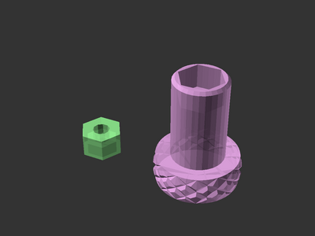

# Knurled Thumb Bolts

[![CC-BY-SA-4.0 license][license-badge]][license]

Knurled thumb bolts for metric bolts

# Description

This model is a work in progress.

## Attribution and License

This model is licensed under [Creative Commons (4.0 International License) Attribution-ShareAlike][license].

This model depends on:

* [The Belfry OpenSCAD Library][bosl]
* [Knurled Surface Library for OpenSCAD][knurled-openscad], based on [aubenc's
  library][knurled-openscad-upstream]

Third party components have their own licenses.

[bosl]: https://github.com/revarbat/BOSL
[knurled-openscad-upstream]: https://www.thingiverse.com/thing:32122
[knurled-openscad]: https://github.com/smkent/knurled-openscad
[license-badge]: /_static/license-badge-cc-by-sa-4.0.svg
[license]: http://creativecommons.org/licenses/by-sa/4.0/
