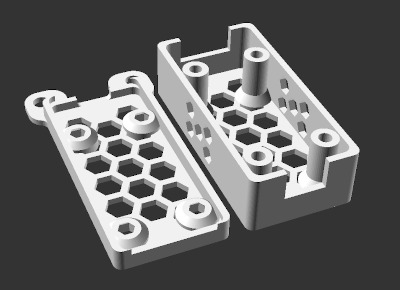

# IP6518 DC to 5V USB-A/C Buck Converter Case

[![Available on Printables][printables-badge]][printables-model]
[![CC-BY-SA-4.0 license][license-badge]][license]

Case for an IP6518 DC to 5V USB-A/C buck converter

# Description

An IP6518 board has a DC barrel input connector, and converts from 12/24V to 5V
USB-A and USB-C. It's perfect for powering a Raspberry Pi from a 3D printer
power supply, such as on the Sovol SV06 Plus. These can be found on Amazon,
eBay, AliExpress, and likely elsewhere.

This model is an IP6518 case that can be mounted to a surface, or to the Sovol
SV06 Plus power supply using the stock PSU bolts. The mount type is configurable
within OpenSCAD.

Required hardware:

* 4x each of M3x16 screws and M3 nuts, to fasten the top and bottom of the case
* M4 mounting screws or bolts if desired. I mounted mine to the back of my Sovol
  SV06 Plus power supply boot using the existing two M4 bolts.

## Setup

See [the top-level README.md](/README.md) for libraries installation.

## Attribution and License

This model is licensed under
[Creative Commons (4.0 International License) Attribution-ShareAlike][license].

This model depends on:

* [Honeycomb Library for OpenSCAD][honeycomb-library-openscad], based on [Gael
  Lafond's library][honeycomb-library-openscad-upstream]

Third party components have their own licenses.

[honeycomb-library-openscad-upstream]: https://printables.com/model/263718
[honeycomb-library-openscad]: https://github.com/smkent/honeycomb-openscad
[license]: http://creativecommons.org/licenses/by-sa/4.0/
[license-badge]: /utils/license-badge-cc-by-sa-4.0.svg
[printables-badge]: /utils/printables-badge.png
[printables-model]: https://www.printables.com/model/605854
