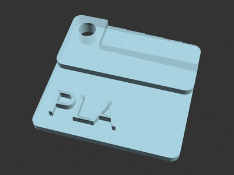

# Material Swatches rebuilt in OpenSCAD (remix)

[![Available on Printables][printables-badge]][printables-model]
[![CC0-1.0 license][license-badge]][license]

[Material Swatches][original-model-url], rebuilt in OpenSCAD

# Description

Material Swatches are a handy reference for filament colors and materials! The
[original model][original-model-url] provides models for a handful of material
types, but is not customizable. This model is built from scratch in OpenSCAD,
which allows creation of swatches with arbitrary text.

Material Swatches also happen to be the perfect size to [store in Gridfinity
bins!][gridfinity-bins-material-swatches]

## Differences of the remix compared to the original

This is a version of Material Swatches created from scratch in OpenSCAD

## Attribution and License

This is a remix of
[**Material Swatches** by **Ryan**][original-model-url].

Both the original model and this remix are licensed under
[Creative Commons CC0 1.0 Universal (Public Domain)][license].

[gridfinity-bins-material-swatches]: https://www.printables.com/model/587675
[license-badge]: /_static/license-badge-cc0-1.0.svg
[license]: http://creativecommons.org/publicdomain/zero/1.0/
[original-model-url]: https://printables.com/model/2256
[printables-badge]: /_static/printables-badge.png
[printables-model]: https://www.printables.com/model/623563
