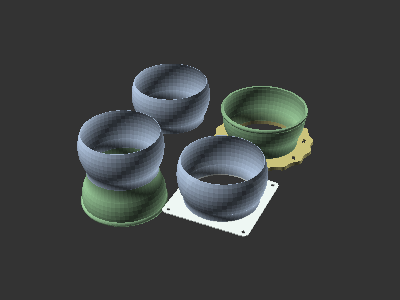
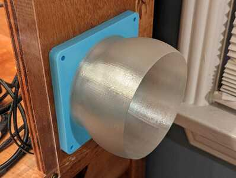
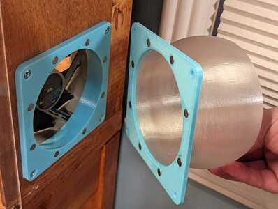
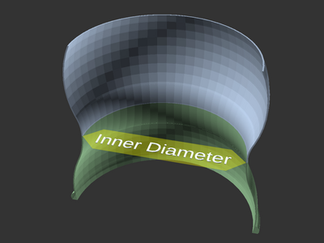
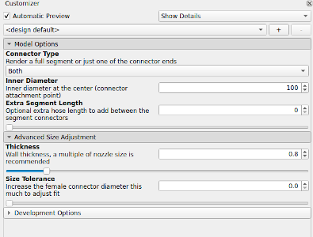
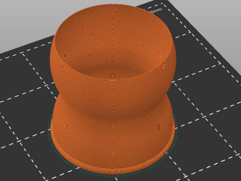
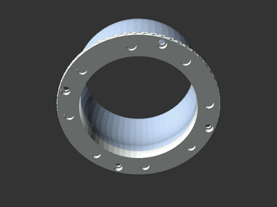
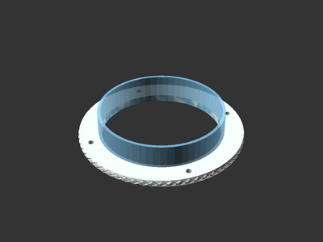
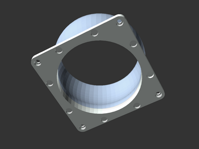
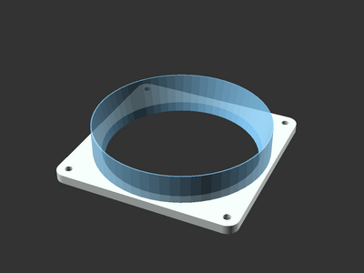

# Parametric and Customizable Segmented Modular Hose

[![CC-BY-SA-4.0 license][license-badge]][license]

A flexible and segmented modular hose to use as an air duct or with a vacuum.
Make and customize your own attachments!

# Description

A flexible segmented hose makes a great air duct for my 3D printer enclosure
exhaust fan.

Inspired by several other
[terrific][flexible-segmented-hose-100mm-by-marius-hornberger]
[segmented][flexible-segmented-vacuum-hose-for-drill-press-by-martins-musings]
[hose][flexible-segmented-vacuum-hose-40mm-for-shopvac-by-teslapunk]
[models][parametric-momdular-hose-library-by-axford], I built my own segmented
modular hose model and library! I chose [OpenSCAD][openscad] so the software and
model would be fully open source.

## Features

This model was built with configurable sizing based on the smallest interior
diameter, such as where the two halves of a segment join at the center:

This diameter, wall thickness, and connector size tolerance are configurable for
all parts. Selecting the same values for each part will create compatible parts.
The default thickness (0.8mm) and size tolerance (0mm) worked well on my printer
with a 0.4mm nozzle.

The model code is also organized as a library, so you can make your own custom
parts!

## Setup and rendering

### Setup

This model uses third-party libraries, such as [BOSL][bosl] for connector curve
math. See [the top-level README.md](/README.md) for libraries installation.

### Model files and rendering

Ensure all of the model's `*.scad` files are placed in the same directory. Open
a part model file (such as `segment.scad`) in OpenSCAD. Select your desired
sizing and options in the OpenSCAD Customizer before rendering each part.

## Printing

Hose segments and connectors are sized to be two walls thick with the default
wall thickness of 0.8mm printed using a 0.4mm nozzle. Hose segments and
connectors should not generate any printed infill material (except for the
female connector end raised lip, depending on the connector diameter).

## Available parts

| Render | Part Info |
| ------ | --------- |
|  | **Flexible segment** (`segment.scad`): Print as many of these as you need for your desired hose length |
|  | **Magnetic round connector** (`magnetic-parts.scad`): A round base connector with base holes for magnets (configurable size). Use with another magnetic connector or a grommet. |
|  | **Magnetic round grommet** (`magnetic-parts.scad`): A round base grommet with base holes for magnets (configurable size). Use with a magnetic connector. |
|  | **Magnetic 120mm fan connector** (`magnetic-parts.scad`): A 120mm fan base connector with base holes for magnets (configurable size). Use with another magnetic connector or a grommet. |
|  | **Magnetic 120mm fan grommet** (`magnetic-parts.scad`): A 120mm fan base grommet with base holes for magnets (configurable size). Use with a magnetic connector. |

## Make your own custom parts and attachments!

Make your own custom parts using `modular-hose-library.scad`!

## Attribution and License

This model is licensed under [Creative Commons (4.0 International License) Attribution-ShareAlike][license].

This model depends on:

* [The Belfry OpenSCAD Library][bosl]
* [Knurled Surface Library for OpenSCAD][knurled-openscad], based on [aubenc's
  library][knurled-openscad-upstream]

Third party components have their own licenses.

[bosl]: https://github.com/revarbat/BOSL
[flexible-segmented-hose-100mm-by-marius-hornberger]: https://www.printables.com/model/22487-flexible-segmented-hose-100mm
[flexible-segmented-vacuum-hose-40mm-for-shopvac-by-teslapunk]: https://www.printables.com/model/107125-flexible-segmented-vacuum-hose-40mm-fits-dn40-pipe
[flexible-segmented-vacuum-hose-for-drill-press-by-martins-musings]: https://www.printables.com/model/528307-flexible-segmented-vacuum-hose-for-drill-press-wit
[knurled-openscad-upstream]: https://www.thingiverse.com/thing:32122
[knurled-openscad]: https://github.com/smkent/knurled-openscad
[license-badge]: /_static/license-badge-cc-by-sa-4.0.svg
[license]: http://creativecommons.org/licenses/by-sa/4.0/
[openscad]: https://openscad.org
[parametric-momdular-hose-library-by-axford]: https://www.thingiverse.com/thing:9457
