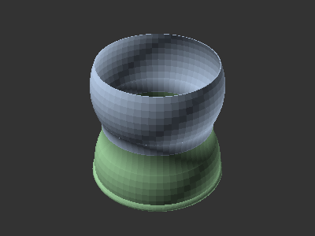
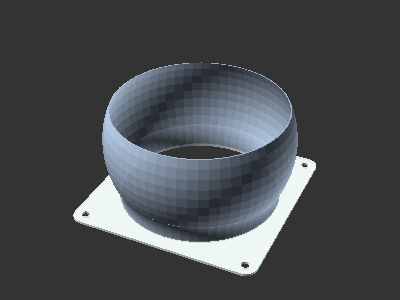

# Segmented Modular Hose

[![CC-BY-SA-4.0 license][license-badge]][license]

A flexible and segmented modular hose that can be used as ducts or with a vacuum

## Setup

See [the top-level README.md](/README.md) for libraries installation.

## Attribution and License

This model is licensed under [Creative Commons (4.0 International License) Attribution-ShareAlike][license].

This model depends on:

* [The Belfry OpenSCAD Library][bosl]

Third party components have their own licenses.

[bosl]: https://github.com/revarbat/BOSL
[license]: http://creativecommons.org/licenses/by-sa/4.0/
[license-badge]: /utils/license-badge-cc-by-sa-4.0.svg
