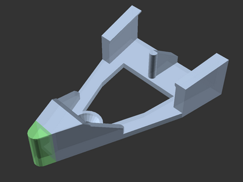

# Nipper Cutter Holder (remix)

[![CC-BY-NC-SA-4.0 license][license-badge]][license]

Remixed holder for your 3D printer's included nipper cutter

# Description

This nipper cutter holder is great for storing the nippers that came with your
3D printer!

I added a closed tip onto
[Muh60's nipper cutter holder model][original-model-url]
to enclose the nipper blade for better safety.

I used [OpenSCAD][openscad] to modify the original model. The source code and
original models are included.

## Differences of the remix compared to the original

For better safety, I extended and closed the cutting end tip on the holder so
the blade would no longer be exposed.

## Attribution and License

This is a remix of
[**Nipper Cutter Holder** by **Muh60**][original-model-url].

Both the original model and this remix are licensed under
[Creative Commons (4.0 International License) Attribution-NonCommercial-ShareAlike][license].

[license-badge]: /_static/license-badge-cc-by-nc-sa-4.0.svg
[license]: http://creativecommons.org/licenses/by-nc-sa/4.0/
[openscad]: https://openscad.org
[original-model-url]: https://www.printables.com/model/575171-nipper-cutter-holder
