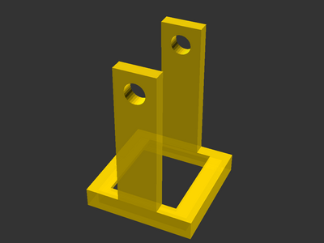
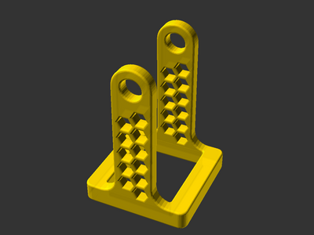

# Ferris wheel base

![This model is a work in progress][work-in-progress-badge]
[![CC-BY-SA-4.0 license][license-badge]][license]

A replacement base for a holiday decoration ferris wheel

## Attribution and License

This model is licensed under [Creative Commons (4.0 International License) Attribution-ShareAlike][license].

This model depends on:

* [Honeycomb Library for OpenSCAD][honeycomb-library-openscad], based on [Gael
  Lafond's library][honeycomb-library-openscad-upstream]

Third party components have their own licenses.

[honeycomb-library-openscad-upstream]: https://printables.com/model/263718
[honeycomb-library-openscad]: https://github.com/smkent/honeycomb-openscad
[license-badge]: /_static/license-badge-cc-by-sa-4.0.svg
[license]: http://creativecommons.org/licenses/by-sa/4.0/
[work-in-progress-badge]: /_static/work-in-progress-badge.svg
