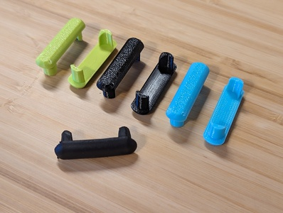
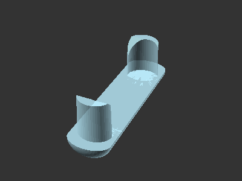

# Keyboard tray slide end cap

[![Available on Printables][printables-badge]][printables-model]
[![CC-BY-4.0 license][license-badge]][license]

End cap for keyboard tray slide

## Description

This is an end cap for under-desk keyboard tray slides, meant to replace an
original that was lost. The dimensions are customizable in OpenSCAD.

## License

This model is licensed under [Creative Commons (4.0 International License) Attribution][license].

[license]: http://creativecommons.org/licenses/by/4.0/
[license-badge]: /_static/license-badge-cc-by-4.0.svg
[printables-badge]: /_static/printables-badge.png
[printables-model]: https://www.printables.com/model/628936
