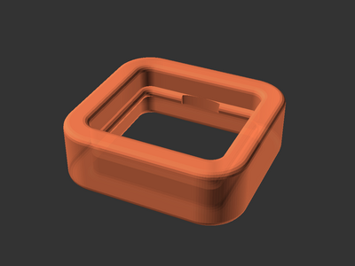

# Tongs Retaining Clip

[![Available on Printables][printables-badge]][printables-model]
[![CC-BY-SA-4.0 license][license-badge]][license]

Simple retaining clip for a pair of tongs

## Description

The retaining clip on my tongs broke, so I printed a new one.

The dimensions are customizable in the OpenSCAD model.

## License

This model is licensed under [Creative Commons (4.0 International License) Attribution-ShareAlike][license].

[license-badge]: /_static/license-badge-cc-by-sa-4.0.svg
[license]: http://creativecommons.org/licenses/by-sa/4.0/
[printables-badge]: /_static/printables-badge.png
[printables-model]: https://www.printables.com/model/637298
