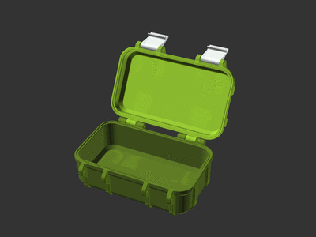
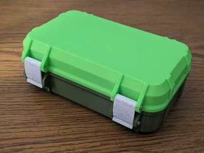
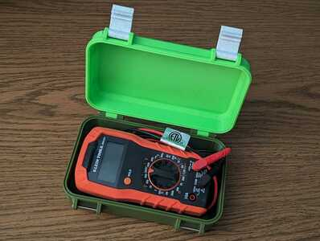
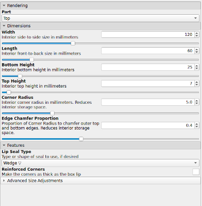
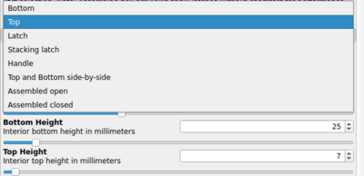
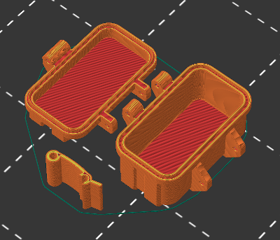
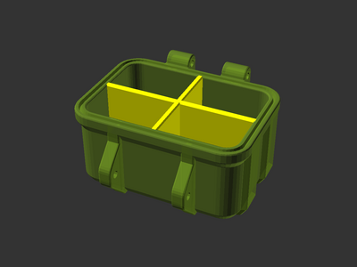
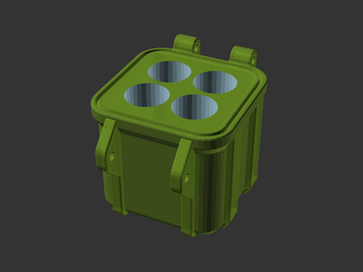

# Rugged Storage Box, Parametric and Customizable

[![Available on Printables][printables-badge]][printables-model]
[![CC-BY-SA-4.0 license][license-badge]][license]

A parametric and customizable rugged storage box or toolbox for OpenSCAD. Make
and customize your own boxes!

# Revision -- January 25, 2024

While creating my
[Gridfinity Rugged Storage Box][gridfinity-rugged-box-model],
I've made some updates to this model.

New features:

* New draw latch option
* New top opening grip and hinge end stop options

Changes:

* The default required screw size is now **M3x40** instead of M3x30
  * Boxes can still be configured for M3x30 screws -- see screw length formula
    below
* The clip latch has been redesigned
* Default sizing for the wall, lip, and screw attachment points have been
  increased
* Latch size tolerance is now subtracted from the latch width instead of added
  to the latch ribs spacing
* The latch edges are chamfered using `minkowski`

# Description

Inspired by
[several][rugged-box-parametric-by-whity]
[other][sbox-by-michael-fanta]
[terrific][frog-box-2.0-by-nibb31]
[rugged][waterproof-box-v2-by-zx82net]
[box][parametrizable-rugged-box-openscad-by-dochni]
[models][customizable-penguin-case-by-ctag],
I built a rugged box model of my own! This model can create
parametric boxes, and can also be used as a library to make customized boxes! I
chose [OpenSCAD][openscad] so the software and model would be fully open source.

## Features

* Configurable sizing, including basic dimensions (width, length, height),
  corner radius, and top/bottom edge chamfer
* Choice of latch style (clip or draw)
* Optional handle
* Optional label
* Optional top opening grip and/or hinge end stops
* Optional lip seal, integrated or for 1.75mm filament
* Optional reinforced (thicker) corners
* All parts print without supports
* Model code organized as a library -- make your own custom boxes!

## Hardware

The hinges and latches are attached using M3 screws, **M3x40** by default. Each
hinge needs 1 screw and each latch needs 2. A box with one latch needs 3 screws
total, while a box with two latches needs 6 screws total.

Boxes with the default sizing options can be assmbled with M3x40 and M3x55 hex
socket head cap screws (DIN 912):

* M3x40 ([AliExpress 1][m3x40-aliexpress-1], [AliExpress 2][m3x40-aliexpress-2],
  [Amazon][m3x40-amazon], [Trimcraft Aviation RC][m3x40-trimcraftaviationrc])
* M3x55 ([AliExpress][m3x55-aliexpress], [Amazon][m3x40-amazon])
  -- if attaching the optional handle

### Screw length formula

* All screws except for boxes with handles:
  * `Latch Width` (default 28mm) + 2 x `Rib Width` (default 6mm).
    At default values, `28 + 2 * 6 = 40`, or M3x40 screws.
  * To use M3x30 screws, set `Latch Width` to 22 and `Rib Width` to 4.

* For boxes with handles, replace two of the above screws with:
  * `Latch Width` (default 28mm) + 3 x `Rib Width` (default 6mm) + handle
    thickness (10mm).
    At default values, `28 + 3 * 6 + 10 = 56`, or about M3x55 screws.

## Rendering

Ensure both `rugged-box.scad` and `rugged-box-library.scad` are placed in the
same directory. Open `rugged-box.scad` in OpenSCAD.

Select your desired dimensions and options in the OpenSCAD Customizer. Then, one
at a time, select each part (top, bottom, latch, and handle) in the Part
drop-down. For each part, perform a render (F6) and export to STL (F7).

## Printing

### Printer preparation

These boxes are (usually) large prints. Clean your print bed and ensure it is
reasonably level.

### Print settings

I have printed boxes from both PLA and PETG.

Print the box top and bottom parts on their outer faces. Latches print on their
side. No supports are needed. For the latches, a brim may be helpful for bed
adhesion.

For stronger boxes, latches, and handle, increase to 3 perimeters and 30%
infill.

## Design your own custom boxes

Design your own custom boxes using `rugged-box-library.scad`! Try one of these
tutorials for inspiration.

| [Tutorial: **Rugged box with dividers**](tutorials/box-with-dividers.md) | [Tutorial: **Rugged box with cutouts**](tutorials/box-with-cutouts.md) |
| --- | --- |
|  |  |

## License

This model is licensed under [Creative Commons (4.0 International License) Attribution-ShareAlike][license].

[customizable-penguin-case-by-ctag]: https://www.thingiverse.com/thing:4852352
[frog-box-2.0-by-nibb31]: https://www.thingiverse.com/thing:4094861
[gridfinity-rugged-box-model]: ../gridfinity/rugged-box/
[license-badge]: /_static/license-badge-cc-by-sa-4.0.svg
[license]: http://creativecommons.org/licenses/by-sa/4.0/
[m3x40-aliexpress-1]: https://www.aliexpress.us/item/3256805665122576.html
[m3x40-aliexpress-2]: https://www.aliexpress.us/item/2251832624557792.html
[m3x40-amazon]: https://amazon.com/dp/B0CFQN9P7Y/
[m3x40-trimcraftaviationrc]: https://www.trimcraftaviationrc.com/index.php?route=product/product&product_id=481
[m3x55-aliexpress]: https://www.aliexpress.us/item/3256802885431338.html
[m3x55-amazon]: https://amazon.com/dp/B0BGM9N73R/
[openscad]: https://openscad.org
[parametrizable-rugged-box-openscad-by-dochni]: https://www.printables.com/model/168664-parametrizable-rugged-box-openscad
[printables-badge]: /_static/printables-badge.png
[printables-model]: https://www.printables.com/model/637028
[rugged-box-parametric-by-whity]: https://www.printables.com/model/258431-rugged-box-parametric
[sbox-by-michael-fanta]: https://www.printables.com/model/262716-sbox-for-mk234-stackable-toolbox-system
[waterproof-box-v2-by-zx82net]: https://www.thingiverse.com/thing:4838803
