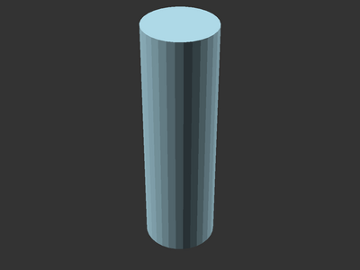
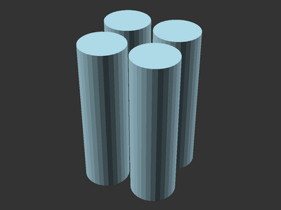
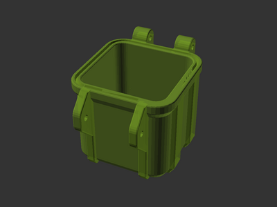
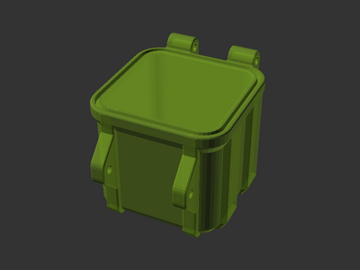

# Rugged box customization tutorial: Box With Cutouts

Tutorial for
[**Rugged Storage Box** model][printables-model] by
[**bulbasaur0** on Printables](https://www.printables.com/@bulbasaur0_1139994).

Follow this tutorial to create a rugged box with cutouts for AA batteries.


## Setup

There are two ways to obtain the model files:

* Clone the [source git repository][github-source] (`git clone
  https://github.com/smkent/monoscad`). The model code will be placed into the
  `monoscad/rugged-box/` directory where the clone was performed.
* Download all of the [model files from Printables][printables-model] and
  extract them all to the same directory.

This tutorial will use build on the model's `rugged-box-library.scad` file.

The finished code for this tutorial is in the included
`tutorial-box-with-cutouts.scad` model file.

## Create New File

Create a new empty `.scad` file in the model directory, and open it in OpenSCAD.
Add a line:

```openscad
include <rugged-box-library.scad>;
```

If the OpenSCAD console does not show an error after saving your file, the
include step worked and you can start your model!

## Step 1: Battery shape

Let's start by creating the shapes to use as cutouts. AA batteries are up to
14.5mm wide and 50mm tall, so we can make a cutout with a cylinder:

```openscad
battery_diameter = 15;
color("lightblue")
cylinder(50, battery_diameter / 2, battery_diameter / 2);
```

The cylinder should appear in OpenSCAD.



## Step 2: Battery holes

Our 40x40mm box can hold four AA batteries, so we need four copies of the cutout
cylinder. We can accomplish this with a `for` loop and some `mirror` calls.
While we're at it, let's also put our cutout code into a module:

```openscad
module battery_holes() {
    battery_diameter = 15;
    for (mirror_x = [0:1:1], mirror_y = [0:1:1]) {
        mirror([0, mirror_y, 0])
        mirror([mirror_x, 0, 0])
        translate([
            battery_diameter / 2 + 1,
            battery_diameter / 2 + 1,
            0
        ])
        cylinder(50, battery_diameter / 2, battery_diameter / 2);
    }
}

color("lightblue")
battery_holes();
```

This places a cutout cylinder in each quadrant around the Z axis, 2mm apart from
each other.



## Step 3: Rugged box initialization

Let's get started with the rugged box model. For now, comment out the
`battery_holes` module call:

```openscad
// color("lightblue")
// battery_holes();
```

The `rbox` module wraps all other rugged box code we'll write. It sets
dimensions and various other properties which can be used in your model. Start
with this:

```openscad
rbox(40, 40, 40)
```

This configures a box with a width of 40, length of 40, and bottom height of 40.
(We are not rendering the top and so have omitted a top height.)

Now, a part may be added as a child module to `rbox`. As the goal is to create a
box bottom with cutouts, use `box_bottom`:

```openscad
rbox(40, 40, 40)
box_bottom();
```

OpenSCAD should now render the box bottom.



## Step 4: Solid box interior

To make a box with cutout holes, the box interior needs to be solid to start
with. The `rbox_interior` module provides the interior shape of the current box
part. Simply adding `rbox_interior` as a child module to `rbox_bottom` creates a
solid box bottom:

```openscad
rbox(40, 40, 40)
rbox_bottom() {
    rbox_interior();
}
```

The box bottom interior should now be solid.



## Step 5: Finished!

With a solid box and cutouts, all that's left is to subtract the cutouts from
the box. Uncomment the `battery_holes` module call and place it as a subtraction
from `rbox_interior` using `difference`:

```openscad
rbox(40, 40, 40)
rbox_bottom() {
    difference() {
        rbox_interior();
        color("lightblue")
        battery_holes();
    }
}
```

The box with storage cutouts is now complete!


[github-source]: https://github.com/smkent/monoscad/tree/main/rugged-box
[printables-model]: https://www.printables.com/model/637028
