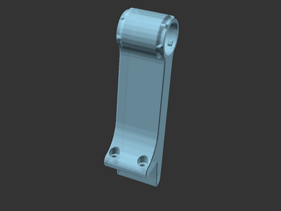
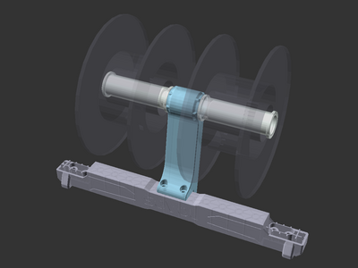

# Sovol SV06 (Plus) 90-degree dual spool holder

[![CC-BY-SA-4.0 license][license-badge]][license]

Sovol SV06 (Plus) 90-degree dual spool holder

# Description

I wanted both a 90-degree rotated and double spool holder for my Sovol SV06
Plus. Using
[the original Sovol SV06 filament barrel nut][original-part-link-sv06],
I created a longer double-ended nut combined with a new base to create this dual
spool holder.

I'm including a slightly tweaked stock spool holder model that increases the
spool holder threads for printing without supports, but may result in a looser
fit. I'm using the included looser spool holder and haven't any fit issues.

## Prerequisites

The SV06 Plus includes a filament runout sensor that mounts on the stock spool
holder assembly. This model doesn't include a mounting point for the runout
sensor, so it should be relocated. I relocated mine to the extruder using
[Breakmate's SV06 Plus filament runout mount][breakmate-sv06-plus-runout-mount],
which has been working great for me.

## Printing

The dual spool holder body prints on its side with no supports. The filament
barrel(s) print upright, with no supports if printing one of the included
chamfered versions. You can reuse the stock spool holder for one of the two
sides, or print two new ones.

## Installation

Remove the original spool holder from the gantry, and reuse the original M4
bolts to attach the new spool holder body. Then, insert both filament spool
barrels into each sides of the integrated nut.

## Add-on even more

Also pictured is
[rogerquin's terrific SV06 (Plus) spool holder add-on][rogerquin-spool-holder-for-sovol-sv06],
which I'm using with each filament barrel. Highly recommended!

## Attribution and License

This model uses the original [Sovol SV06 barrel nut][original-part-link-sv06].

This model is licensed under
[Creative Commons (4.0 International License) Attribution-ShareAlike][license].

[breakmate-sv06-plus-runout-mount]: https://www.printables.com/model/493623-sv06-plus-filament-runout-mount
[license-badge]: /_static/license-badge-cc-by-sa-4.0.svg
[license]: http://creativecommons.org/licenses/by-sa/4.0/
[original-part-link-sv06]: https://github.com/Sovol3d/SV06-Fully-Open-Source/blob/main/Molded%20Parts%20STL/JXHSV06-07003-d%20Barrel%20nut.STL
[sovol-sv06]: https://github.com/Sovol3d/SV06-Fully-Open-Source
[rogerquin-spool-holder-for-sovol-sv06]: https://www.printables.com/model/409684-spool-holder-for-sovol-sv06-3d-printer
