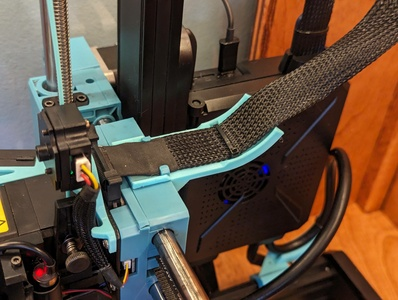
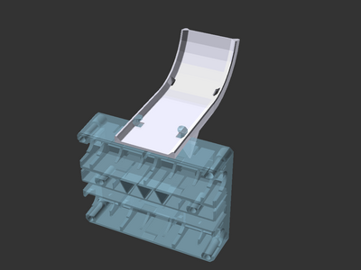
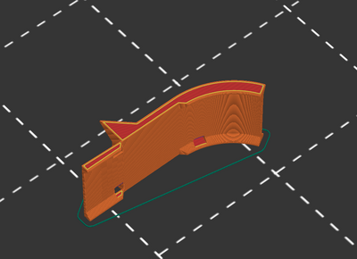

# Sovol SV06 Plus extruder mounted cable support

![This model is a work in progress][work-in-progress-badge]
[![CC-BY-SA-4.0 license][license-badge]][license]

Extruder mounted cable support for the Sovol SV06 and SV06 Plus

# Description

Keep your Sovol SV06 or SV06 Plus extruder cable elevated with this cable
support!

This model was created in [OpenSCAD][openscad]. The default curve angle of 60°
is customizable in the OpenSCAD model.

## Recommended pairing

This model pairs well with
[my mainboard box-mounted extruder cable support (remix)][sv06-mainboard-cable-support].

## Printing

This prints on its side. A brim may be useful for bed adhesion.

## Installation

Remove the extruder cable from the clips on top of the extruder housing. Slide
the support onto the clips, and then reinstall the extruder cable into the
clips on top of the support. Fasten the cable to the support at the curve with a
zip tie.

## Attribution and License

This model is licensed under
[Creative Commons (4.0 International License) Attribution-ShareAlike][license].

[license-badge]: /_static/license-badge-cc-by-sa-4.0.svg
[license]: http://creativecommons.org/licenses/by-sa/4.0/
[openscad]: https://openscad.org
[sv06-mainboard-cable-support]: ../mainboard-cable-support/
[work-in-progress-badge]: /_static/work-in-progress-badge.svg
