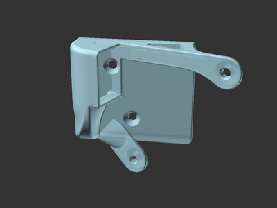
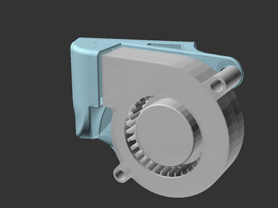

# Sovol SV06 (Plus) 5015 extruder fan duct (remix)

![This model is a work in progress][work-in-progress-badge]
[![CC-BY-NC-4.0 license][license-badge]][license]

Fan duct to use a 5015 fan for coldend cooling on the Sovol SV06 and SV06 Plus

## Differences of the remix compared to the original

The 5015 fan duct has been flipped on the Z-axis, so the fan's inlet side faces
away from the extruder. Some minor design tweaks were added.

## Attribution and License

This is a remix of:

* [**Sovol SV06 / Plus Extruder Cooling Fan 5015** by **Leander Perez Blanco**][original-model-url].
* Original [Sovol SV06][sovol-sv06] and [Sovol SV06 Plus][sovol-sv06-plus] model parts

Both the original model and this remix are licensed under
[Creative Commons (4.0 International License) Attribution-NonCommercial][license].

This model also uses
[**5015 Radial Fan** by **FarmerKGBOfficer**][5015-fan-model] (CC0 - public domain)
for model preview rendering.

[5015-fan-model]: https://www.printables.com/model/304318-5015-blower-fan
[license-badge]: /_static/license-badge-cc-by-nc-4.0.svg
[license]: http://creativecommons.org/licenses/by-nc/4.0/
[original-model-url]: https://www.printables.com/model/472199-sovol-sv06-plus-extruder-colling-fan-5015
[sovol-sv06-plus]: https://github.com/Sovol3d/SV06-PLUS
[sovol-sv06]: https://github.com/Sovol3d/SV06-Fully-Open-Source
[work-in-progress-badge]: /_static/work-in-progress-badge.svg
