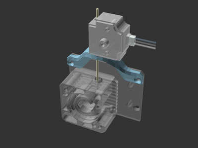

# Filament runout sensor extruder mount for Sovol SV06 Plus

[![CC-BY-SA-4.0 license][license-badge]][license]

An extruder mount for the filament runout sensor on the Sovol SV06 Plus

## License

This model is licensed under [Creative Commons (4.0 International License) Attribution-ShareAlike][license].

[license-badge]: /_static/license-badge-cc-by-sa-4.0.svg
[license]: http://creativecommons.org/licenses/by-sa/4.0/
