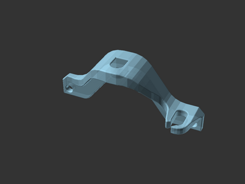
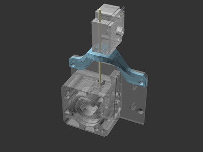
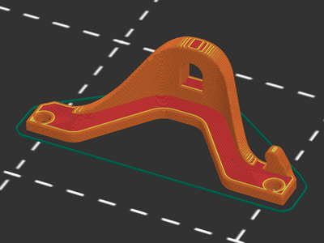
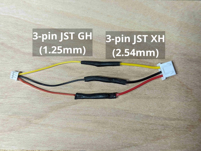
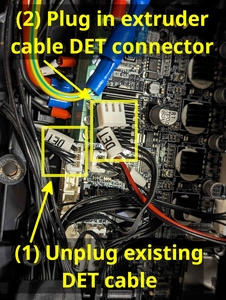
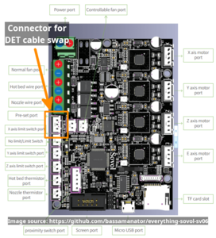

# Filament runout sensor extruder mount for Sovol SV06 Plus

[![CC-BY-SA-4.0 license][license-badge]][license]

An extruder mount for the filament runout sensor on the Sovol SV06 Plus

# Description

Move your Sovol SV06 Plus filament runout sensor from the spool to the
extruder with this mount! Placing the sensor closer to the extruder reduces
filament wasted at the end of a spool, and frees up space on the gantry for
a [dual filament spool holder][dual-spool-holder].

Model variants are included for two different wiring connection types:

* Rear-facing filament runout sensor, to use the stock runout sensor wiring
  (easiest installation, but may interfere with auto Z-align function)
* Side-facing filament runout sensor, to use the extruder filament runout
  sensor wiring port on the right side (recommended - cleaner installation,
  requires extra hardware and minor soldering)

## Acknowledgements

Although this model is my own original creation, I was inspired by two other
excellent models:

[Breakmate's SV06 Plus filament runout mount][breakmate-sv06-plus-mount]
inspired the shape of my model. It was a fun challenge implementing this in
[OpenSCAD].

[PhantomAura's Sovol SV06 Plus Ultimate Filament Runout Sensor Mount][phantomaura-sv06-plus-mount-remix]
remix explains how to use the extruder's filament runout sensor connector, which
led me to create a side-facing filament runout sensor mount variant.

## Hardware

For all model variants, 2 M3 bolts are needed to attach the mount to the
extruder housing. M3x8 or M3x10 are recommended.

For the side-facing filament runout sensor, you'll need to make a simple but
custom wiring harness using these parts:

* JST GH (1.25mm) 3-pin male connector and wires
* JST XH (2.54mm) 3-pin male connector and wires

## Printing

This prints on its back with no special instructions.

## Installation

To start the installation for all model variants:

* Unload filament from the extruder
* Use the two M3 bolts to attach the printed model to the front top two screw
  holes on the extruder housing
* Insert the filament sensor foot into the hole on the top of the model. The fit
  is designed to be very snug.

## Rear-facing filament runout sensor model variant for stock wiring

For the rear-facing filament runout sensor model that uses the stock wiring,
route the stock 3-wire filament runout sensor wiring from the mainboard box
along the extruder cable harness to the extruder. Secure the wiring together
with zip ties. Then, simply plug the 3-pin connector into the filament runout
sensor.

Note that the rear-facing filament runout sensor wiring may interfere with the
auto Z-align leveling function, which raises the X-axis to the top of the gantry
for alignment. The side-facing filament runout sensor model variant does not
interfere with the auto Z-align leveing function.

## Side-facing filament runout sensor model variant for custom wiring

### Wiring harness

Before installing this model on your printer, create a custom wiring harness
using a 3-pin JST GH (1.25mm) male connector wired to a 3-pin XH (2.54mm) male
connector:

### Mainboard wiring swap

The Sovol SV06 and SV06 Plus extruders include an unused 3-pin JST GH (1.25mm)
port on the right side that can be used to connect a filament runout sensor. The
side-facing filament runout sensor model will connect to this unused port using
a custom wiring harness.

This side port on the extruder is not connected from the factory. Wiring is
included in the extruder wiring harness for this connector, but is simply not
connected in the mainboard box by default.

First, turn off and unplug your printer. Then, remove the single M4 bolt from
the outer side of the mainboard box and open the lid on the box.

Locate and unplug the stock 3-pin filament runout sensor wiring (labeled `DET`).
Then, locate the extruder wiring harness' filament runout sensor wiring (also
labeled `DET`) and plug that wire into the same mainboard connector:

(Mainboard diagram image credit: [bassamantor/everything-sovol-sv06][bassamantor-everything-sovol-sv06])

Close the mainboard box and reinstall the M4 bolt to secure it shut.

### Model installation

Finally, complete the installation by plugging the custom wiring harness into
both the extruder and filament runout sensor.

This model variant includes a small retaining grip for the wiring harness to
prevent it from interfering with the extruder mount's movement along the X-axis.

## License

This model is licensed under [Creative Commons (4.0 International License) Attribution-ShareAlike][license].

[breakmate-sv06-plus-mount]: https://www.printables.com/model/493623-sv06-plus-filament-runout-mount
[dual-spool-holder]: /sovol-sv06-plus/dual-spool-holder
[license-badge]: /_static/license-badge-cc-by-sa-4.0.svg
[license]: http://creativecommons.org/licenses/by-sa/4.0/
[openscad]: https://openscad.org
[phantomaura-sv06-plus-mount-remix]: https://www.printables.com/model/596377-sovol-sv06-plus-ultimate-filament-runout-sensor-mo
[bassamantor-everything-sovol-sv06]: https://github.com/bassamanator/everything-sovol-sv06
