# Sovol SV06 Plus Heat Bed Cable Support Bundle for tight spaces

[![Available on Printables][printables-badge]][printables-model]
[![CC-BY-NC-SA-4.0 license][license-badge]][license]

This is a two-piece heat bed cable support set for the Sovol SV06 Plus when
placed near a wall

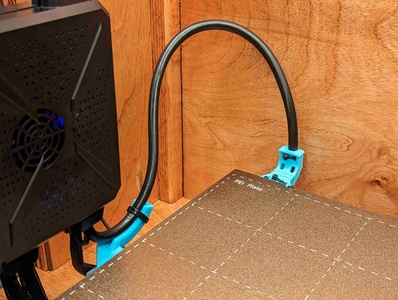
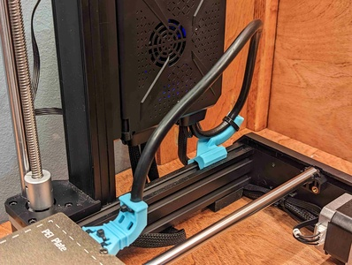

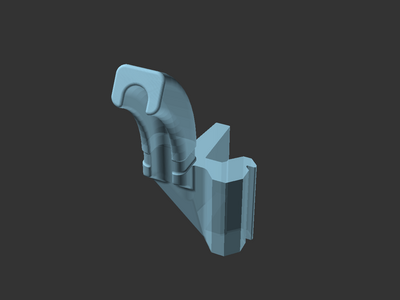
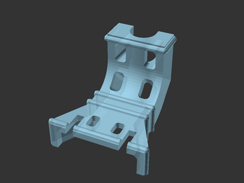

# Version 2

**Heat bed strain relief support V2 is here!**

I've been printing with the original bed strain relief support clip since I
published it a few months ago. The printer's original bed strain relief cover
that this fits onto is slightly wobbly. Once in a while, the bottom of the
looped zip tie would catch on the printer frame while moving to home, preventing
the bed from moving all the way back.

I redesigned this part from scratch to attach through the printer's strain
relief cover holes for a more stable fit!

# Description

In making an enclosure for my Sovol SV06 Plus, the heat bed cable would get
squashed against the rear wall when the bed moved to the far back (such as when
moving to home). I wanted the cable to be held upright without restricting the
motion of the bed.

To accomplish this, I modified
[rogerquin's Heatbed Cable Support for SOVOL SV06 / SV06+ 3d printer][original-model-url]
and added a support clip to fit over the heat bed cable strain relief cover.

In exploring solutions, I've learned the hot bed cable and strain relief
included with the SV06 Plus differs from those on the SV06, so these pieces may
not work on the SV06. The [OpenSCAD][openscad] source model and STL parts are
included for remixing.

## Hardware

You'll need 3 zip ties (2 of which should be small):

* 1 zip tie for the frame strain relief support clip
* Between 2 and 4 small zip ties for the bed strain relief cover support clip (I
  used 2)

## Printing

**Orientation**: Both parts print oriented as rendered – the frame support clip
prints upright, and the heat end bed support clip prints on its back side.

**Brim (optional)**: A brim for one or both parts may be needed depending on
your bed adhesion. The heat bed end support clip has a low bed contact surface
area.

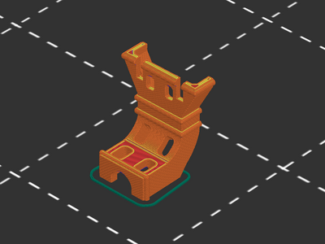
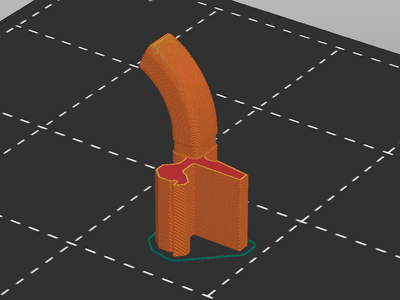

## Installation

Both parts clip on and should be fastened with zip ties.

### Frame strain relief support

The frame support clip tilts into the printer frame slot. Attach a zip tie to the heat
bed cable on top of the clip to keep it in place.

### Bed strain relief support installation steps

The heat bed strain relief support clip fits over top of the existing SV06 Plus
strain relief cover. Secure it in place with a small zip ties:
* One zip tie through the top strain relief cover holes, looping around the heat
  bed cable on the bottom
* Another zip tie on the upright vertical heat bed cable support

If desired, zip ties can also be placed on the end of the strain relief cover
overlap, and on the middle of the support curve.

Installation steps in photos:

| Photo | Description |
| --- | --- |
| 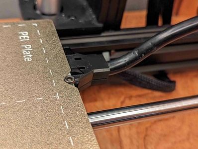 | Original Sovol strain relief cover |
| 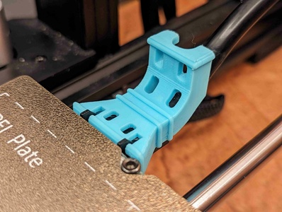 | Fit the printed bed strain relief support on top of the original Sovol strain relief cover |
| 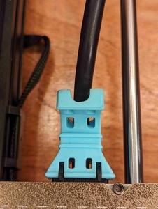 | View from above, with holes for zip ties visible |
| 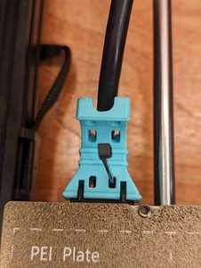 | Thread a zip tie through one of the holes at the bed end of the frame clip |
| 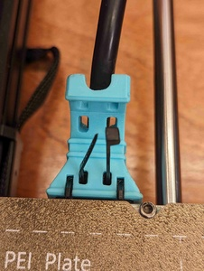 | Loop the zip tie all the way down and around the heat bed cable on the bottom, and through the second hole on the bed strain relief support |
| 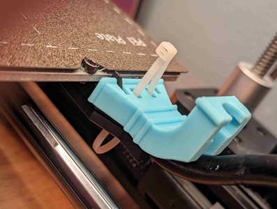 | Sample photo of the first zip tie looped all the way down and around (white zip tie used for contrast) |
| 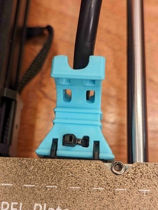 | Tighten the first zip tie and remove the excess |
| 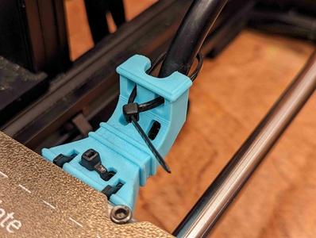 | Thread another zip tie through the top holes and around the back of the bed support cable |
| 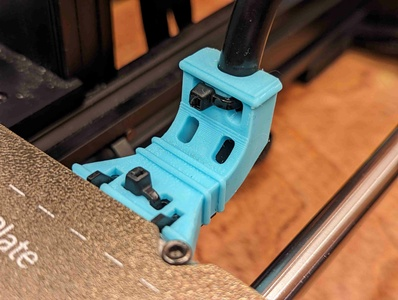 | Tighten the second zip tie and remove the excess. All done! |
| 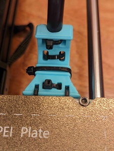 | (Optional) If desired, add two more zip ties as pictured. |

## Remixing

For further remixing, I've included the [OpenSCAD][openscad] source model for
the bed strain relief support clip. The source model uses the
[original Sovol SV06 Plus strain relief part][original-part-link-sv06-plus] for
fit and shapes of various components. With all of the source
files in the same directory, open `bed-strain-relief-support-v2.scad` in
OpenSCAD.

The included SV06 Plus strain relief cover STL files are repaired copies of
Sovol's original part (also included). The original part STL produced CGAL
errors in OpenSCAD.

## Previous version

[Heat bed strain relief support V1][bed-strain-relief-support-v1-stl]
was created in TinkerCAD, and is still included in the model files.

## Attribution and License

This is a remix of:

* [**Heatbed Cable Support for SOVOL SV06 / SV06+ 3d printer** by **rogerquin**][original-model-url].
* Original [Sovol SV06 Plus][sovol-sv06-plus] model parts

Both the original model and this remix are licensed under
[Creative Commons (4.0 International License) Attribution-NonCommercial-ShareAlike][license].

[bed-strain-relief-support-v1-stl]: bed-strain-relief-support-v1/bed-strain-relief-support-v1.stl
[license-badge]: /_static/license-badge-cc-by-nc-sa-4.0.svg
[license]: http://creativecommons.org/licenses/by-nc-sa/4.0/
[openscad]: https://openscad.org
[original-model-url]: https://www.printables.com/model/409689-heatbed-cable-support-for-sovol-sv06-sv06-3d-print
[original-part-link-sv06-plus]: https://github.com/Sovol3d/SV06-PLUS/blob/master/SV06%20PLUS%203D/STL/JXHSV06P-01000%20base%20assembly/JXHSV06-01009-d%20Hot%20Bed%20Wire%20Fixing%20Cover.STL
[printables-badge]: /_static/printables-badge.png
[printables-model]: https://www.printables.com/model/584534
[sovol-sv06-plus]: https://github.com/Sovol3d/SV06-PLUS
