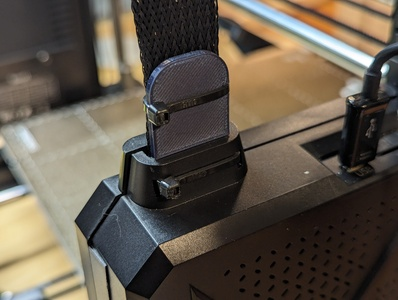
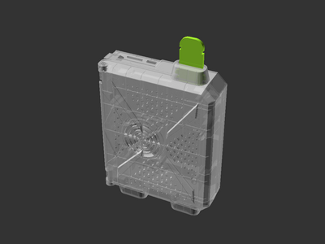
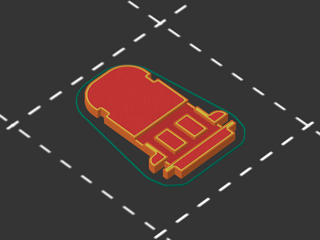
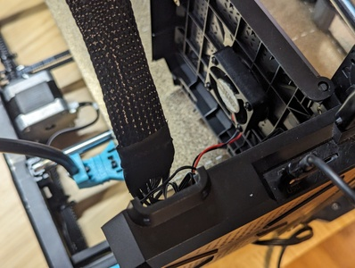
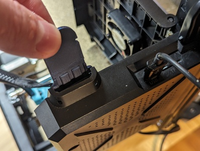
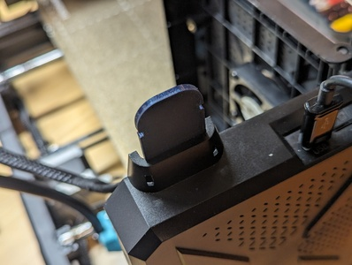
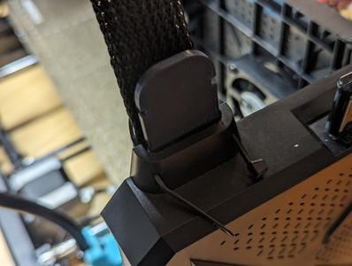
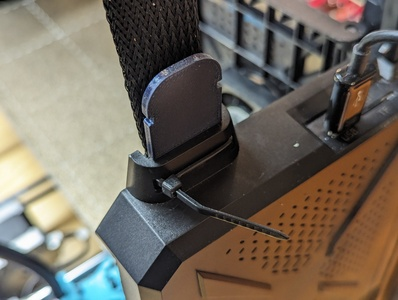
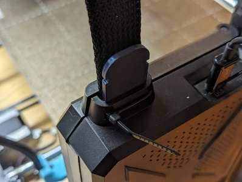

# Sovol SV06 Plus mainboard extruder cable support (remix)

[![Available on Printables][printables-badge]][printables-model]
[![CC-BY-SA-4.0 license][license-badge]][license]

Mainboard extruder cable support for the Sovol SV06 and SV06 Plus

# Description

Keep your Sovol SV06 or SV06 Plus extruder cable elevated with this cable
support! This remixes
[itsrouteburn's Sovol SV06 Plus Print Head Cable Support][original-model-url]
for better stability with a more snug fit.

## Printing

This prints with no supports and no special instructions.

## Installation

**Note:** The original model installs on the front side of the extruder cable.
This model is the opposite and installs on the back side of the extruder cable,
facing away from the printer.

First, turn off your printer. Open the mainboard case by removing the screw on
the rear.

Then, continue the installation with these instructions:

| Photo | Description |
| --- | --- |
|  | Photo of opened mainboard box |
|  | Insert the printed support into the cable lip with the grooves facing the rear of the box |
|  | Photo of support correctly inserted |
|  | Holding the extruder cable next to the support, thread a zip tie through the mainboard box lip holes, around the support and cable, and bath through the opposite hole |
|  | Fasten the zip tie |
|  | Close the mainboard box and re-install the screw |
|  | Attach a second zip tie around the support and extruder cable using the upper notches on the support. Trim the zip ties excess. All done! |

## Differences of the remix compared to the original

I added grooves to and reduced the length of itsrouteburn's mainboard
box-mounted cable support model for better stability with a more snug fit.

## Attribution and License

This is a remix of
[**Sovol SV06 Plus Print Head Cable Support** by **itsrouteburn**][original-model-url].

Both the original model and this remix are licensed under
[Creative Commons (4.0 International License) Attribution-ShareAlike][license].

[license-badge]: /_static/license-badge-cc-by-sa-4.0.svg
[license]: http://creativecommons.org/licenses/by-sa/4.0/
[original-model-url]: https://www.printables.com/model/427286-sovol-sv06-plus-print-head-cable-support
[printables-badge]: /_static/printables-badge.png
[printables-model]: https://www.printables.com/model/689656
