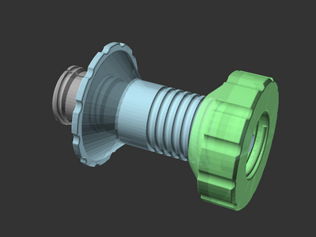
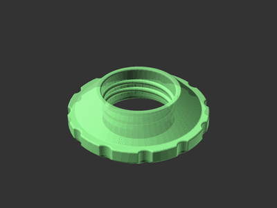
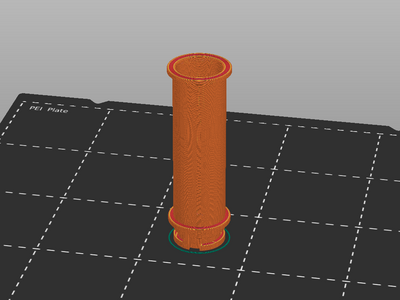
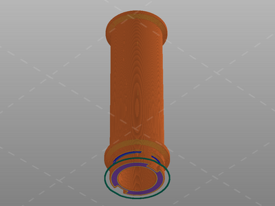
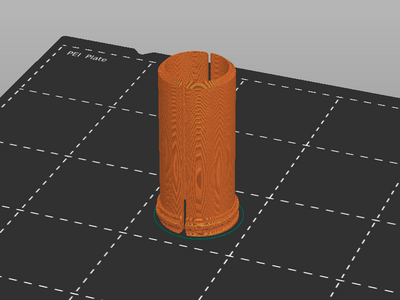
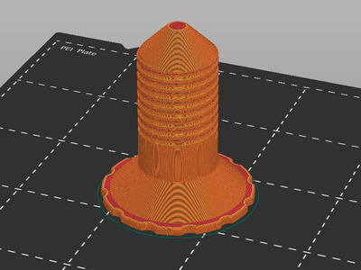
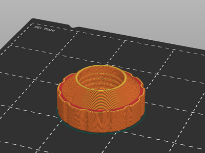

# Spool Holder remix for Sovol SV06 and SV06 Plus

[![CC-BY-NC-SA-4.0 license][license-badge]][license]

A remix of rogerquin's excellent locking spool holder which mounts over the
original Sovol SV06 spool barrel

# Description

I've been using
[rogerquin's most excellent spool holder for the Sovol SV06 (Plus)][original-model-url].
In wanting a larger grip area for both regular spools and large diameter (e.g.
Sunlu) spools, I made two changes to rogerquin's original model. First, I
combined the spool barrel with the Sunlu barrel adapter into a single piece.
Then, I extended the large diameter (Sunlu) nut for an easier grip.

## Parts

This model is fully printable, no additional hardware is needed.

**Compatibility note:** The spool holder is specifically sized to fit over the
stock **SV06** filament barrel. The stock filament barrel on the **SV06 Plus**
has a larger end cap and is not compatible -- but the SV06 filament barrel
(model included!) can simply be printed and used in its place.

The parts to print are all included:

* SV06 filament barrel (if not using the stock SV06 filament barrel). The
  included copy is slightly modified from the original, so that it can be
  printed without supports.
* Spool holder barrel fittings
* Spool holder barrel
* Spool holder nut

If you have a [dual spool holder][sv06-dual-spool-holder], you'll need two
sets of each part.

## Spool holder nut configuration

The spool holder nut in the published model is 15mm longer than the original.
This is configurable in the OpenSCAD model if you prefer a different length.

## Printing

All of these parts print as oriented in the model files (upright) with no
supports and no special instructions.

Concentric top and bottom infill patterns make a nice aesthetic for these parts,
but this is optional.

### Slicer screenshots

SV06 filament barrel:

Barrel fitting:

Barrel:

Nut:

## Installation

If you have an SV06 Plus and/or want to use a printed copy of the SV06 filament
barrel, remove the stock filament barrel and install the printed filament
barrel.

While holding both of the spool holder barrel fittings on the spool holder,
slide the spool holder barrel on top of the fittings. Hold the barrel fittings
steady on their ends while twisting the spool holder onto their threads, until
the barrel is flush with the fittings. I use my fingers to hold the barrel
fittings steady but you may find it easier to do with a screwdriver or other
tool.

Finally, place a spool of filament on the barrel and screw on the nut until the
spool is held at the center by the chamfered ends of both the barrel and nut.
The spool and spool barrel should turn freely on the SV06 filament barrel.

To change spools, simply unscrew the nut, swap out the spool, and reinstall the
nut.

## Remixing

I used [OpenSCAD][openscad] to create this remix. The original parts and my
OpenSCAD source are all included for further remixing. There are two OpenSCAD
source files:

* `spool-holder.scad` for the modified parts from
  [rogerquin's original model][original-model-url]
* `filament-barrel.scad` for the original Sovol SV06 filament barrel part,
  chamfered to print without supports

## Differences of the remix compared to the original

The original barrel and Sunlu (72mm) barrel adapter have been combined into a
single part. The original Sunlu (72mm) nut has been extended for an easier grip.

## Attribution and License

This is a remix of
[**Spool Holder for SOVOL SV06 3d printer** by **rogerquin**][original-model-url].

Both the original model and this remix are licensed under
[Creative Commons (4.0 International License) Attribution-NonCommercial-ShareAlike][license].

[license-badge]: /_static/license-badge-cc-by-nc-sa-4.0.svg
[license]: http://creativecommons.org/licenses/by-nc-sa/4.0/
[openscad]: https://openscad.org
[original-model-url]: https://www.printables.com/model/409684-spool-holder-for-sovol-sv06-3d-printer
[sv06-dual-spool-holder]: /sovol-sv06-plus/dual-spool-holder/
