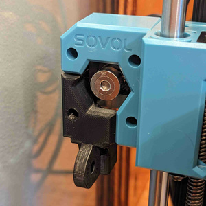

# Articulating Camera X-Axis Left-Side Mount for Sovol SV06 (Plus)

[![Available on Printables][printables-badge]][printables-model]
[![CC-BY-4.0 license][license-badge]][license]

Articulating camera mount that screws onto the left-side X-axis stepper motor
housing on the Sovol SV06 and SV06 Plus

# Description

Mount a camera to move with your Sovol SV06 or SV06 Plus' Z-axis with this screw
on mount! This part screws onto the the left side X-axis stepper motor housing,
and provides an attachment base for
[Sneaks' articulating camera mount system][original-model-url].

Models for both male and female articulated camera mount bases are provided.

## Hardware

A single M3x10 bolt is needed to attach the mount to the stepper motor housing.

## Printing and installation

These parts print as oriented in the model files with no supports and no special
instructions. Once printed, screw the part onto the left side X-axis stepper
motor housing using the M3x10 bolt. Then, attach something to the articulated
camera mount!

## Remixing

For further remixing, I've also included the blank piece I created to attach the
articulated camera mount links onto. I used [OpenSCAD][openscad] to glue these
parts together. That model file is included as well. With all of the source
files in the same directory, open `sv06-xaxis-mount-right.scad` in OpenSCAD.
The included articulated mount attachment base pieces were prepared in
TinkerCAD.

## See also

I also have a [SV06 (Plus) X-axis right side mount!][x-axis-mount-right]

I used
[Zach's remixed articulating camera mount thumb bolt heads][zach-steel-m5-bolt-model]
with steel M5x20 bolts.

I used
[areyouferretti's articulated mount tripod bolt][areyouferretti-tripod-bolt]
to mount a Logitech C920 webcam to my articulated mount.

## Differences of the remix compared to the original

I modeled a new X-axis stepper motor attachment blank based on Sovol's original
stepper motor parts for the SV06 and SV06 Plus. I then added links from Sneaks'
articulating camera mount.

## Attribution and License

This is a remix of:

* [**Articulating Raspberry Pi Camera Mount for Prusa MK3 and MK2** by
  **Sneaks**][original-model-url]
* Original [Sovol SV06][sovol-sv06] and [Sovol SV06 Plus][sovol-sv06-plus] model parts

Both the original model and this remix are licensed under
[Creative Commons (4.0 International License) Attribution][license].

[areyouferretti-tripod-bolt]: https://www.printables.com/model/354264-14-inch-standard-tripod-thumb-bolt-for-articulatin
[license-badge]: /_static/license-badge-cc-by-4.0.svg
[license]: http://creativecommons.org/licenses/by/4.0/
[openscad]: https://openscad.org
[original-model-url]: https://www.printables.com/model/3407-articulating-raspberry-pi-camera-mount-for-prusa-m
[printables-badge]: /_static/printables-badge.png
[printables-model]: https://www.printables.com/model/647727
[sovol-sv06-plus]: https://github.com/Sovol3d/SV06-PLUS
[sovol-sv06]: https://github.com/Sovol3d/SV06-Fully-Open-Source
[x-axis-mount-right]: /sovol-sv06-plus/xaxis-articulating-mount-right
[zach-steel-m5-bolt-model]: https://www.printables.com/model/424253-steel-thumb-bolt
