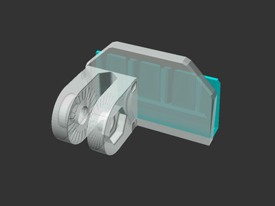

# Articulating Camera X-Axis Mount for Sovol SV06 (Plus)

[![CC-BY-4.0 license][license-badge]][license]

Articulating camera mount that pressure fits into the right-side X-Axis linear
rod housing on the Sovol SV06 and Sovol SV06 Plus

## Attribution and License

This is a remix of:

* [**Articulating Raspberry Pi Camera Mount for Prusa MK3 and MK2** by
  **Sneaks**][original-model-url]
* Original [Sovol SV06][sovol-sv06] and [Sovol SV06 Plus][sovol-sv06-plus] model parts

Both the original model and this remix are licensed under
[Creative Commons (4.0 International License) Attribution][license].

[original-model-url]: https://www.printables.com/model/3407-articulating-raspberry-pi-camera-mount-for-prusa-m
[license]: http://creativecommons.org/licenses/by/4.0/
[license-badge]: /_static/license-badge-cc-by-4.0.svg
[sovol-sv06]: https://github.com/Sovol3d/SV06-Fully-Open-Source
[sovol-sv06-plus]: https://github.com/Sovol3d/SV06-PLUS
