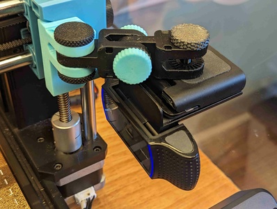
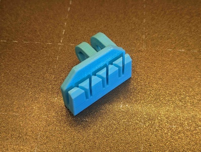
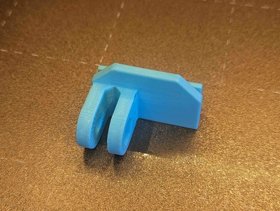
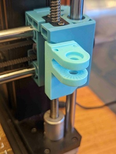
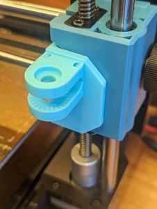

# Articulating Camera X-Axis Right-Side Mount for Sovol SV06 (Plus)

[![CC-BY-4.0 license][license-badge]][license]

Articulating camera mount that press-fits into the right-side X-axis linear rod
housing on the Sovol SV06 and SV06 Plus

# Description

Mount a camera to move with your Sovol SV06 or SV06 Plus' Z-axis with this
press-fit mount! This part slides into the right side X-axis linear rod housing,
and provides an attachment base for
[Sneaks' articulating camera mount system][original-model-url].

The X-axis linear rod housing on the SV06 and SV06 Plus are different, and
models for both printers are included. Plus, models for both male and female
articulated camera mount bases are provided.

## Printing and installation

These parts print as oriented in the model files with no supports and no special
instructions. Once printed, simply slide the part into the right side X-axis
housing and attach something to the articulated camera mount!

## Remixing

For further remixing, I've also included blank and bare press-fit pieces for the
SV06 and SV06 Plus X-axis housing. I used [OpenSCAD][openscad] to glue these
parts together. That model file is included as well. With all of the source
files in the same directory, open `sv06-xaxis-mount-right.scad` in OpenSCAD.

The included SV06 and SV06 Plus tensioning mount slice STL files are reduced
copies of Sovol's original parts (also included). I did the initial slicing of
the original parts in TinkerCAD as OpenSCAD produced CGAL errors while
subtracting from the original parts.

## Attribution and License

This is a remix of:

* [**Articulating Raspberry Pi Camera Mount for Prusa MK3 and MK2** by
  **Sneaks**][original-model-url]
* Original [Sovol SV06][sovol-sv06] and [Sovol SV06 Plus][sovol-sv06-plus] model parts

Both the original model and this remix are licensed under
[Creative Commons (4.0 International License) Attribution][license].

[license-badge]: /_static/license-badge-cc-by-4.0.svg
[license]: http://creativecommons.org/licenses/by/4.0/
[openscad]: https://openscad.org
[original-model-url]: https://www.printables.com/model/3407-articulating-raspberry-pi-camera-mount-for-prusa-m
[sovol-sv06-plus]: https://github.com/Sovol3d/SV06-PLUS
[sovol-sv06]: https://github.com/Sovol3d/SV06-Fully-Open-Source
