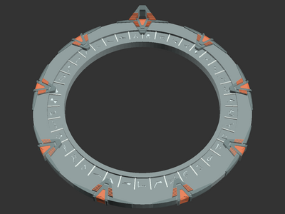
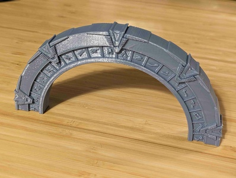
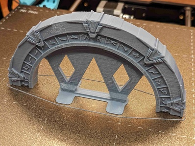

# SG-1 Stargate with symbols (remix)

[![Available on Printables][printables-badge]][printables-model]
[![CC-BY-4.0 license][license-badge]][license]

Parametric SG-1 Stargate models for display, hanging, or handle/drawer pulls

# Description

Print your own Stargate as a display model, hanging ornament, or handle/drawer
pull!

I reworked [wtgibson's SG-1 Stargate OpenSCAD model][original-model-url]
for better use in [OpenSCAD][openscad], and further reimplemented a
half-stargate handle like [viper1619's remix][original-handle-model-url]. You
can also add a hanging loop for use as an ornament!

Stargates and any diameters can be created using OpenSCAD.

## Hardware and installation

Handle models install with two screws or bolts. The handles are sized by hole
separation similar to most drawer or cabinet pulls. The uploaded rendered models
have 2.8mm holes, for use with M3 screws. The hole size is configurable within
OpenSCAD.

For easier installation, a drill guide for the handle can be created in
OpenSCAD.

## Printing

Single-sided Stargate models print easily facing upwards.

Stargate handle models print standing up, and are best printed with supports.
You can add supports with your slicer or use the model's built-in supports
option. I printed my handles with 3 perimeters for better strength around the
holes.

I printed my Stargate handle with model supports. I used a utility knife to help
remove the support structure at the top end of the ring.

## Differences of the remix compared to the original

I replaced the Inkscape-generated OpenSCAD import files with OpenSCAD shape
implementations for all parts except the symbols. The symbols are now applied
directly from an SVG file within OpenSCAD.

## Attribution and License

This is a remix of:

* [**SG-1 Stargate with symbols** by **wtgibson**][original-model-url]
* [**Stargate Handle (used on my i3 enclosure)** by **viper1619**][original-handle-model-url]

The original models and this remix are licensed under
[Creative Commons (4.0 International License) Attribution][license].

[license-badge]: /_static/license-badge-cc-by-4.0.svg
[license]: http://creativecommons.org/licenses/by/4.0/
[openscad]: https://openscad.org
[original-handle-model-url]: https://www.thingiverse.com/thing:1875360
[original-model-url]: https://www.thingiverse.com/thing:87691
[printables-badge]: /_static/printables-badge.png
[printables-model]: https://www.printables.com/model/657480
