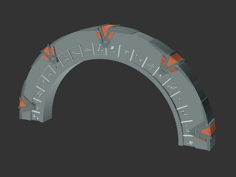
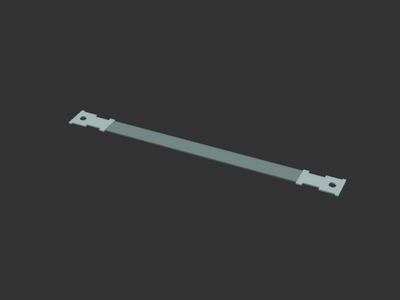
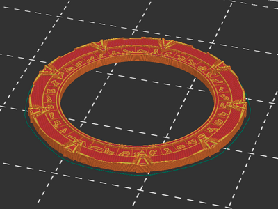
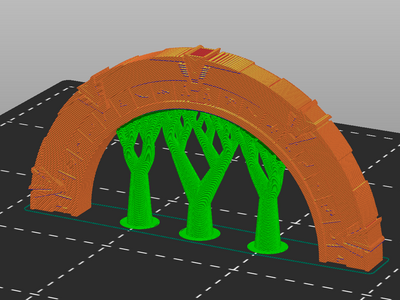
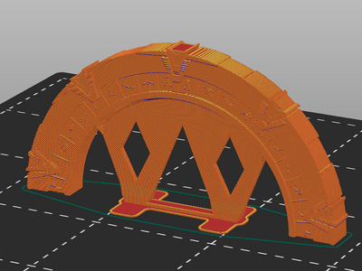

# SG-1 Stargate with symbols (remix)

[![CC-BY-4.0 license][license-badge]][license]

Parametric SG-1 Stargate and Stargate handle models

# Description

I reworked [wtgibson's SG-1 Stargate OpenSCAD model][original-model-url]
for better use in [OpenSCAD][openscad], and further reimplemented a
half-stargate handle like [viper1619's remix][original-handle-model-url].
Stargates and handles of any diameters can be created using OpenSCAD.

## Hardware and installation

Handle models install with two screws or bolts. The handles are sized by hole
separation similar to most drawer or cabinet pulls. The hole size is
configurable within OpenSCAD.

For easier installation, a drill guide for the handle can be created in
OpenSCAD.

## Printing

Single-sided Stargate models print easily facing upwards.

]

Stargate handle models print standing up, and are best printed with supports.
You can add supports with your slicer or use the model's built-in supports
option.

]
]

## Differences of the remix compared to the original

I replaced the Inkscape-generated OpenSCAD import files with OpenSCAD shape
implementations for all parts except the symbols. The symbols are now applied
directly from an SVG file within OpenSCAD.

## Attribution and License

This is a remix of:

* [**SG-1 Stargate with symbols** by **wtgibson**][original-model-url].
* [**Stargate Handle (used on my i3 enclosure)** by **viper1619**][original-handle-model-url]

The original models and this remix are licensed under
[Creative Commons (4.0 International License) Attribution][license].

[license-badge]: /_static/license-badge-cc-by-4.0.svg
[license]: http://creativecommons.org/licenses/by/4.0/
[openscad]: https://openscad.org
[original-handle-model-url]: https://www.thingiverse.com/thing:1875360
[original-model-url]: https://www.thingiverse.com/thing:87691
