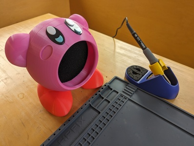
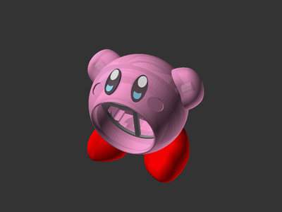

# Kirby Fume Extractor for 120mm Fan (remix)

![This model is a work in progress][work-in-progress-badge]
[![CC-BY-4.0 license][license-badge]][license]

A remixed fume extractor in the shape of our favorite pink blob

# Description

I scaled up
[Chris Borge's fantastic Kirby fume extractor model][original-model-url]
to fit a 120mm fan! I modified the fan bay fit so no trimming should be required
for a 120mm fan. Options are available for using screws or heat set inserts to
secure the fan. I also integrated
[JosteinG's eye parts][original-model-eyes-url] so I could print the different
eye bits in their respective colors.

I used [OpenSCAD][openscad] to modify the original model. The source code and
original model parts used are included.

## Hardware

* 120mm fan
* 130mm activated carbon filter (I used [these][carbon-filters])
* 4x M4 screws to secure the fan (often times these will come with a fan)
* Optional: heat set inserts if you prefer those instead of thread-forming
  screws
* Optional: Power source adapter if desired instead of just running the fan
  wiring out of the back. I attached my fan wiring to a configurable USB-C decoy
  board (such as [one][usb-c-decoy-option-1] of [these][usb-c-decoy-option-2]
  set to 12 volts) and installed that into the back body part before assembly.

## Printing

All of my Kirby parts are printed in PLA.

I used a number of different settings for the various parts:

* Face:
  * Oriented with the mouth side facing down
  * 3 perimeters
  * 5% support cubic infill
  * Archimedean chords bottom fill pattern
  * Brim enabled
* Back:
  * Oriented with the rear side facing down
  * 3 perimeters
  * 5% support cubic infill
  * Archimedean chords bottom fill pattern
  * Brim enabled
  * Manually painted supports on body screw threads, snug style
* Grill:
  * 10% support cubic infill
  * Archimedean chords bottom fill pattern
  * 3 perimeters
  * Automatic supports, snug style
* Inner fan spacer:
  * 10% support cubic infill
  * 3 perimeters
* Arms:
  * 10% support cubic infill
  * 3 perimeters
  * Concentric top and bottom fill patterns
* Arm pins:
  * 20% support cubic infill
  * 3 perimeters
* Feet:
  * 10% adaptive cubic infill
  * 3 perimeters
  * Concentric top fill pattern
  * Manually painted supports on feet connector insert cavity overhang,
    organic style
* Feet connector
  * 20% adaptive cubic infill
  * 4 perimeters
* Eye bases
  * 5% support cubic infill
* Eye inserts (blue)
  * 5% support cubic infill
* Eye inserts (white)
  * 5% support cubic infill
  * Archimedean chords top and bottom fill pattern

## Assembly

General assembly steps:

* Glue or otherwise attach the feet to the feet connector.
* Insert the feet with feet connector into the back body piece slot.
  * I opted not to glue the feet connector onto the back body so the feet could
    be removed/adjusted later. I stuffed some blue tack (picture hanging putty)
    into the body back piece behind the feet connector to keep the feet
    connector in place.
* If you chose to print the body back part with the heat set inserts option,
  install the four heat set inserts.
* Run your fan wiring through the hole/slot in the back body piece.
* Insert and secure the fan to the back body piece.
* Place the inner fan spacer on the back body piece where the face body piece
  will screw on.
* Place a charcoal filter on top of the inner fan spacer.
* Screw the face body piece onto the back body piece. The charcoal filter
  between the two pieces will fill the gaps in the screw threads and hold the
  body parts snug.
* Screw the rear body fan grill onto the rear body part.
* Glue/attach the arm pins onto the arms, and glue/attach the arms onto the
  body.
* Glue/attach the eye pieces together, and glue/attach the assembled eyes onto
  the body.

## Differences of the remix compared to the original

Chris Borge's original model has been scaled up to fit a 120mm fan, and combined
with JosteinG's remix with multi-part eyes for multiple colors.

## Attribution and License

This is a remix of:

* [**Kirby 40mm Fume Extractor** by **Chris Borge**][original-model-url]
* [**Kirby's eye in three separate parts** by **JosteinG**][original-model-eyes-url]

Both the original model and this remix are licensed under
[Creative Commons (4.0 International License) Attribution][license].

[carbon-filters]: https://amazon.com/dp/B0C2VN85RH/
[license-badge]: /_static/license-badge-cc-by-4.0.svg
[license]: http://creativecommons.org/licenses/by/4.0/
[original-model-eyes-url]: https://www.printables.com/model/437712-kirbys-eye-in-three-separate-parts
[original-model-url]: https://www.printables.com/model/348385-kirby-40mm-fume-extractor
[usb-c-decoy-option-1]: https://www.aliexpress.com/item/3256805358753597.html
[usb-c-decoy-option-2]: https://www.aliexpress.com/item/3256804809774180.html
[work-in-progress-badge]: /_static/work-in-progress-badge.svg
