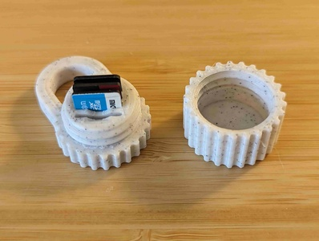
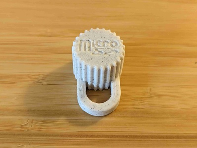
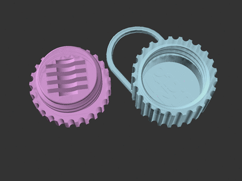
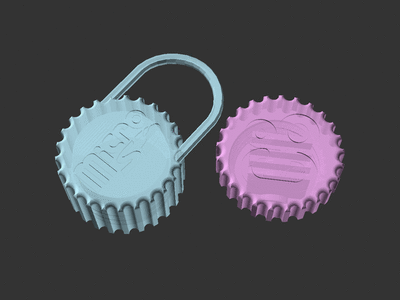
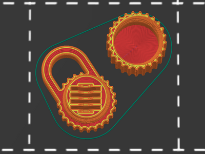

# MicroSD card holder keychain (parametric remix)

[![Available on Printables][printables-badge]][printables-model]
[![CC-BY-NC-4.0 license][license-badge]][license]

A parametric remix of Guido's tiny 4-card MicroSD keychain holder

# Description

This is a small parametric rework of [Guido's model][original-model-url] to
allow some customization using [OpenSCAD][openscad]:

* Swap the keychain loop to the other half or remove it entirely
* Change the size of the keychain loop
* Swap or remove the inset logos

## Printing

I printed this with my default 0.4mm nozzle and 0.2mm layer height. No supports
are needed.

Using concentric infill for the top and bottom infill patterns looks nice on
this model.

## Differences of the remix compared to the original

I added options to swap or disable the keychain loop, change the size and
thickness of the loop, and to swap or disable the inset logos.

## Attribution and License

This is a remix of
[**MicroSD card holder keychain** by **Guido**][original-model-url].

Both the original model and this remix are licensed under
[Creative Commons (4.0 International License) Attribution-NonCommercial][license].

[license-badge]: /_static/license-badge-cc-by-nc-4.0.svg
[license]: http://creativecommons.org/licenses/by-nc/4.0/
[openscad]: https://openscad.org
[original-model-url]: https://www.printables.com/model/276691-microsd-card-holder-keychain
[printables-badge]: /_static/printables-badge.png
[printables-model]: https://www.printables.com/model/668746
